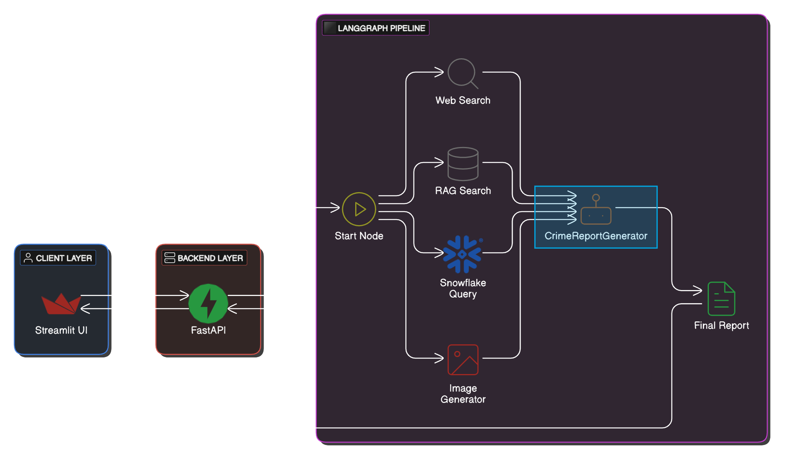
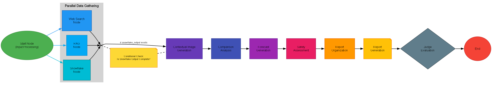

# Mulit-Agentic-Hackthon-Project
# Crime Analysis Multi-Agent Research Assistant

This repository implements a multi-agent research assistant integrating:

- **RAG Agent:** Uses Pinecone (index: `crime-reports`) with metadata filtering (namespaces like `2023q1`, `2024q2`, etc.) to retrieve historical crime records.
- **Web Search Agent:** Uses SerpAPI for real-time web search on crime trends and incidents.
- **Snowflake Agent:** Queries structured crime statistics stored in Snowflake to generate summary and charts.
- **ImageGenerator Agent:** Uses image generation capabilities to build “contextual” images.
- **Comparision Agent:** Uses Snowflake data to compare data amongst different citites to compare the safety in each city against each other.

---

## 📚 Crime Analysis Agentic Architecture Workflow


DEMO: https://northeastern-my.sharepoint.com/:v:/g/personal/mate_r_northeastern_edu/Efem9GpbHaBBpiGy6ZTCAioB6bqzmorEBhrIoxRSSLF_0Q?e=hwlnvd&nav=eyJyZWZlcnJhbEluZm8iOnsicmVmZXJyYWxBcHAiOiJTdHJlYW1XZWJBcHAiLCJyZWZlcnJhbFZpZXciOiJTaGFyZURpYWxvZy1MaW5rIiwicmVmZXJyYWxBcHBQbGF0Zm9ybSI6IldlYiIsInJlZmVycmFsTW9kZSI6InZpZXcifX0%3D

---
Overview


---

## ⚡️ Prerequisites

- Python 3.10+
- Poetry for dependency management
- Docker (optional)
- AWS account for S3 access
- Pinecone account
- Snowflake account
- SerpAPI key

---

## 🧠 Architecture Components
### 1. State Management
- Uses `CrimeGPTState` TypedDict for maintaining pipeline state.
- Tracks inputs, intermediate results, and final outputs.
- Manages conversation history and agent reasoning steps.

### 2. Node Structure
- **start_node:** Entry point, processes initial query.
- **web_search_node:** Real-time web data collection.
- **rag_search_node:** Historical document retrieval (Pinecone).
- **snowflake_node:** Crime statistics querying.
- **agent_node:** LLM-based analysis integration.
- **report_generator_node:** Final report compilation.

### 3. Flow Sequence

---

## 🔄 Data Processing
### 1. Input Processing
- Query analysis and search type determination.
- Period selection for targeted analysis.

### 2. Parallel Data Collection
- Web scraping for current information.
- RAG-based document retrieval.
- Snowflake crime statistics querying.

### 3. Analysis Integration
- Claude 3 Haiku model for analysis.
- Tool-augmented reasoning.
- Multi-source data synthesis.

### 4. Report Generation
- Structured output formatting.
- Key findings compilation.
- Source attribution.

---

## 🚀 Key Features
- Hybrid search capabilities (vector + metadata)
- Error handling and recovery
- State persistence across nodes
- Parallel execution paths
- Modular tool integration
- Visualization support

---

## 🔧 Tools Integration
- **Web Search:** SerpAPI integration
- **RAG:** Pinecone vector store
- **Database:** Snowflake connection
- **LLM:** Anthropic Claude 3
- **Visualization:** Graphviz
## Deployed links 
- FASTAPI  = https://fastapi-crimereport-app-84150543519.us-central1.run.app/docs
- STREAMLIT = https://crime-report-analyzer.streamlit.app/
  
## Deployed links 
- FASTAPI  = [https://fastapi-crimereport-app-84150543519.us-central1.run.app/docs](https://fastapi-crimereport-app-84150543519.us-central1.run.app)
- STREAMLIT = [https://crime-report-analyzer.streamlit.app/](https://crime-analysis-report.streamlit.app/)

# 🛠️ Environment Setup

## 1. Environment Variables
Create a `.env` file with:
```ini
PINECONE_API_KEY=your_key
OPENAI_API_KEY=your_key
SERP_API_KEY=your_key
SNOWFLAKE_USER=your_user
SNOWFLAKE_PASSWORD=your_password
SNOWFLAKE_ACCOUNT=your_account
SNOWFLAKE_WAREHOUSE=your_warehouse
SNOWFLAKE_DATABASE=your_database
SNOWFLAKE_SCHEMA=your_schema
AWS_SERVER_PUBLIC_KEY=your_key
AWS_SERVER_SECRET_KEY=your_key
AWS_REGION=your_region
 

## 
## # Using Make
make backend

# Manual
uvicorn main:app --host 0.0.0.0 --port 8080 --reload


##Start Frontend

# Using Make
make frontend

# Manual
streamlit run streamlit_app.py --server.port 8501

##  Docker Deployment

make fastapibuild
make streamlitbuild


## Run Containers

make fastapirun
make streamlitrun
